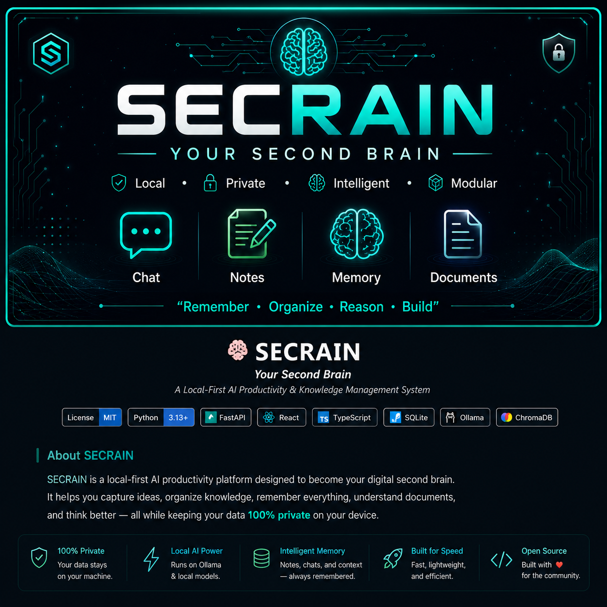
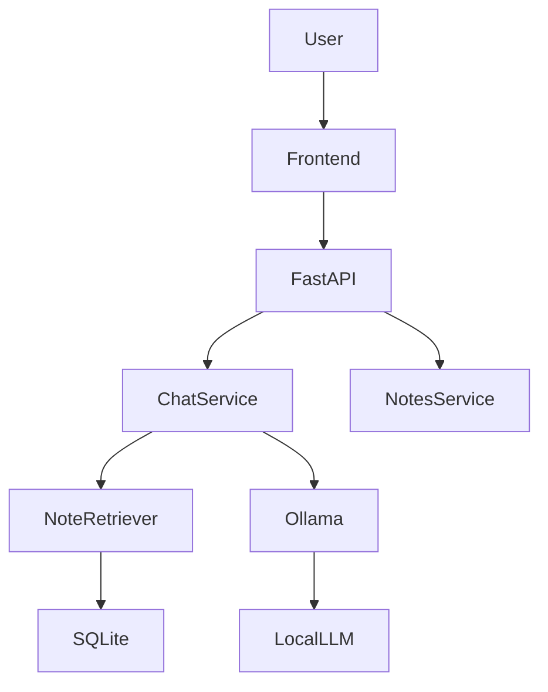
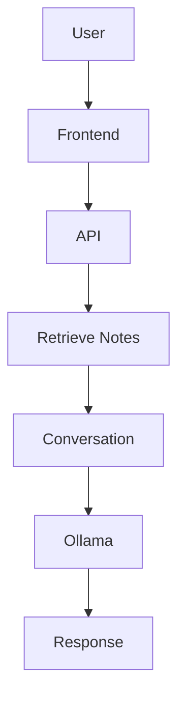

<p align="center">
  
</p>

<h1 align="center">🧠 SECRAIN</h1>

<p align="center">
  <strong>Your Second Brain</strong><br>
  Local-First AI Productivity & Knowledge Management System
</p>

<p align="center">


</p>

---

> **SECRAIN** is a local-first AI productivity platform designed to become your permanent digital second brain.
>
> It remembers your knowledge, organizes your notes, retrieves context intelligently, and assists you using private, on-device AI.

---


# 🧠 SECRAIN

> **Your Second Brain** --- A local-first AI productivity platform.

## 🌟 Vision

SECRAIN is a modular AI operating system focused on privacy, memory, and
productivity. It combines AI chat, persistent memory, notes, and future
knowledge modules into one local-first application.

## 🎯 Purpose

-   Build a true second brain
-   Keep user data local
-   Provide long-term memory
-   Deliver extensible, clean architecture

## 🏗 Architecture



## 🔄 Workflow



## 📁 Current Repository

``` text
SECRAIN/
├── backend/
│   ├── app/
│   ├── frontend/
│   ├── .venv/
│   └── ...
├── LICENSE
└── README.md
```

## ✅ Current Features

-   AI Chat
-   Persistent Conversations
-   Notes
-   Intelligent Note Retrieval
-   Ollama Integration
-   SQLite Storage

## 🚧 Planned

-   ChromaDB Semantic Memory
-   PDF Chat
-   Tasks
-   Dashboard
-   Voice Assistant

## ▶ Run

### Backend

``` bash
cd backend
.venv\Scripts\activate
uvicorn app.main:app --reload
```

### Frontend

``` bash
cd backend/frontend
npm install
npm run dev
```

## 🤝 Contributing

Fork → Branch → Commit → Pull Request

## 📜 License

MIT

------------------------------------------------------------------------

**SECRAIN** aims to become a complete local AI operating
system---remembering, organizing, reasoning, and helping you build.
